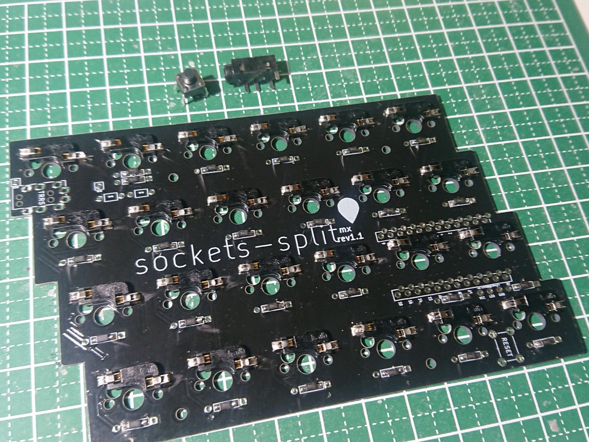
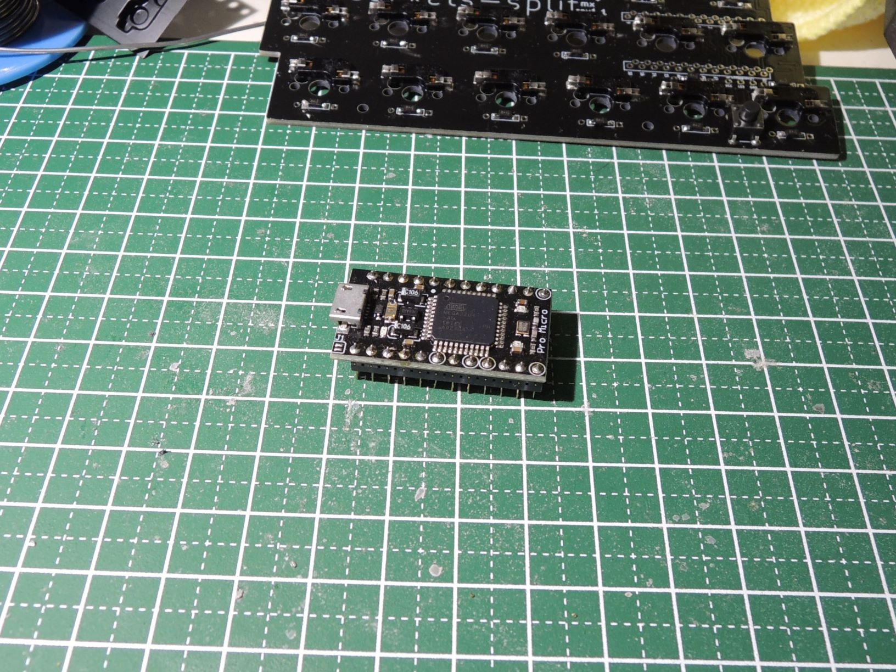

# PCB組み立て

このパートでははんだを利用するので大変危険です。注意して作業してください。  
組み立ては背の低いパーツから行います。  
背の低い順に

1. ダイオード
2. スイッチソケット
3. リセットスイッチ
4. ジャック
5. （オプション）UnderglowLED
6. ProMicro（ソケット付け）

## それぞれの注意点を書く

## ダイオード

ダイオードには極性があるので向きに気を付けてはんだ付けしけてください。  
極性の向きを書く

## スイッチソケット

ソケットを乗せる前に薄くはんだをつけておくとはんだ付けしやすいです。  
薄く乗せたはんだの上にソケットをしっかり差し込み再びしっかり温めてはんだ付けします。その際しっかりと差し込むようにしてください。  

## リセットスイッチ

向きに注意してはんだ付けしてください。  
はんだ付けした後の脚は、切らなくても大丈夫な想定ですが、切ったほうが確実にプレートに干渉しないです。  

## ジャック

ダイオード、ソケットと同じ面に部品を載せ、はんだ付けしてください。  
はんだ付けした後の脚は、切らなくても大丈夫です。  

### (option)i2c

ジャック下のパッドがつながっている部分を
i2cを利用する際ははんだでつなげず、R1,R2にそれぞれ4.7kΩ抵抗をつけてください。  

## ProMicro

ProMicroに同梱されているピンヘッダでも構いませんが、 `抜き差しできる`コンスルーピンヘッダを使用する例を載せます。  
通常ProMicroに同梱されているピンヘッダでは裏側へのはんだ付けも必要になります。  
はんだ付けの面は両手とも以下の画像の向きで作成してください。  

基板にProMicroを載せます。  

向きはいろいろと実装されている方が表になるようにし、ピンヘッダを通したら表面をはんだ付けします。  

## （オプション）UnderglowLED

基板のProMicroの下部にUnderglowLED用の配線をしてあります。  
LEDテープなどに対してそれぞれ対応した部分をはんだ付けしてください。LEDも向きが決まっているので注意してください。  
