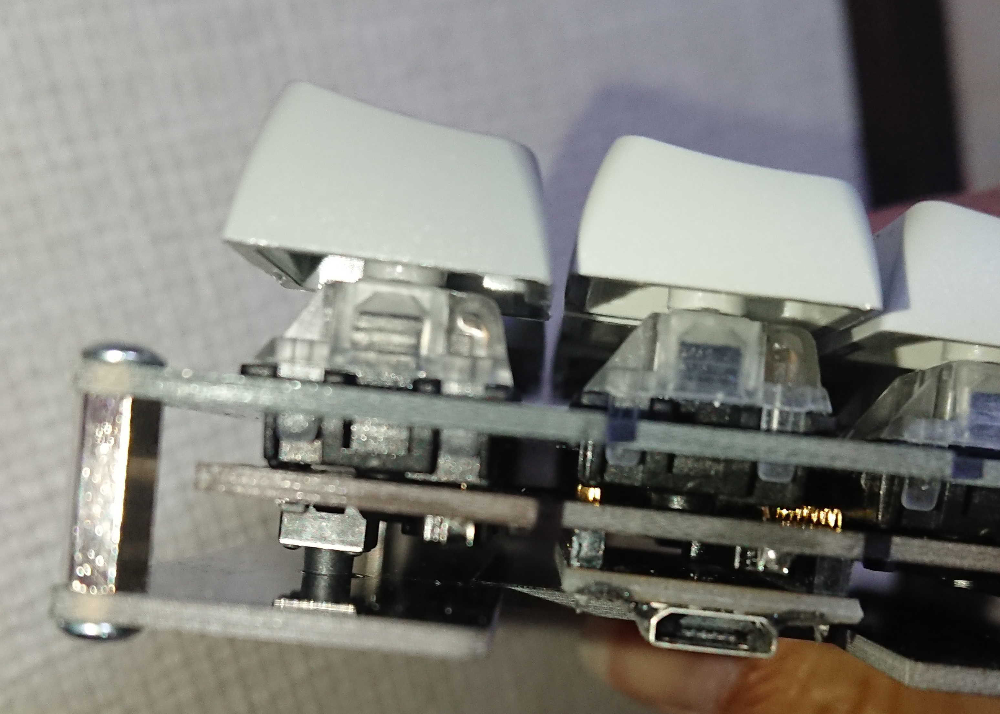
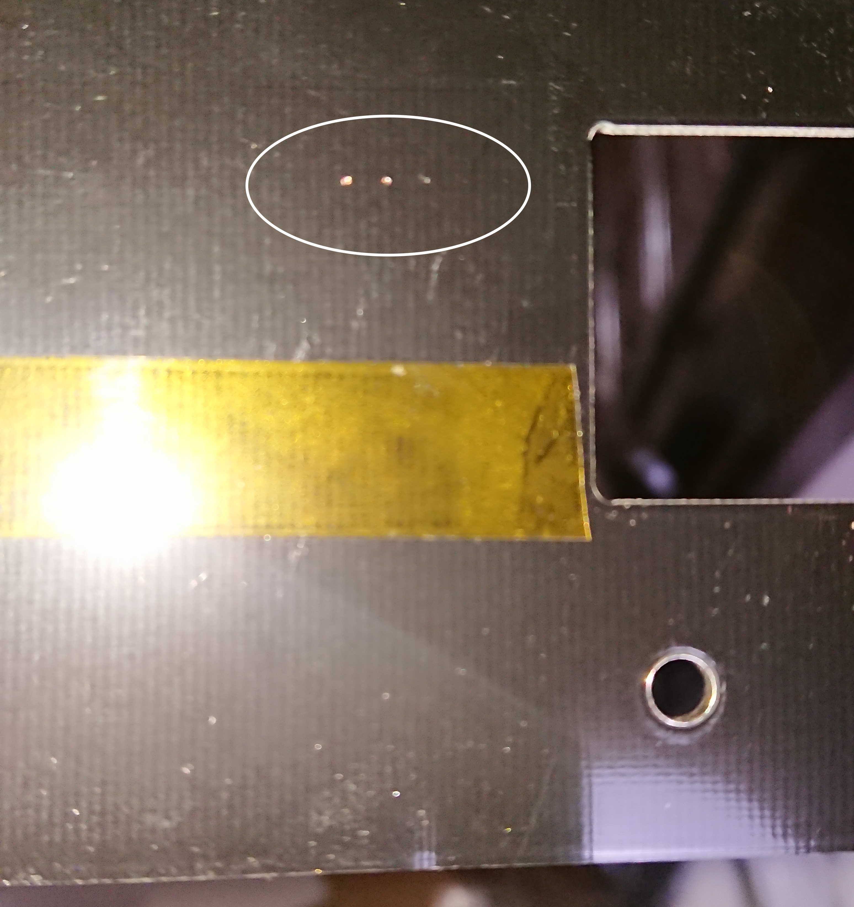

# ケース、スイッチ組み立て

PCBの四隅と間に4つの穴が空いていると思いますが、外周四隅をスペーサーとネジで止めていきます。  

1. アクリルの保護シートを剥がします
2. 向きを確認します。下側アクリルの凹みの向きがpromicroと同じ向きかどうかを確認します
3. キースイッチを基板の穴の向きに合わせて上側のアクリルとソケットに挿し込みます
4. 片手24キーをすべて終えたら四隅にスペーサーをネジで止めます
5. 下側のアクリルの位置を合わせ、スペーサーをネジ止めします

以上の手順を両手分行うと、キーボードの筐体は完成です。残りはファームウェアの書き込みです！  

## rev1.2, 1.3の注意点

右手側に2つほど注意する点があります。報告してくださったkase様、ありがとうございます。  
まずpromicroのピンとスイッチが干渉してしまいます。実際の使用時には全く気にならないですが、どうしても浮いてしまいます。  
こちらを了承していただいた上での購入をよろしくお願いします。  
rev1.3は安めの値段設定で出させていただきます。対称配列を試したい方向けです。  
rev2で解消予定です。  

promicroのピンヘッダのはんだ付け次第では、以下の画像の用にマスクを貫通し、銅板を通して短絡してしまうことがあるようです。  
ボトムプレートに絶縁テープを貼っていただくのがよいと思われます。  
今のところ作者の環境では発生していませんが、参考までに。  

